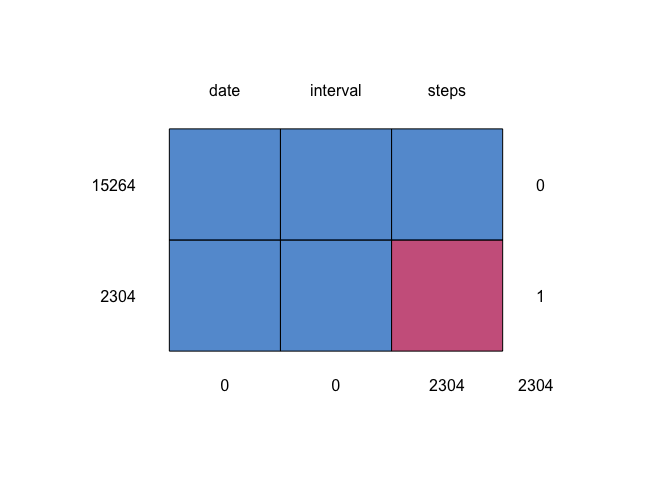

## Loading and preprocessing the data
Load the required packages for the assignment and check if the working directory is right. 

```r
library(ggplot2)
library(dplyr)
library(mice)
getwd()
```
Then read the activity dataset with *read_csv( )* and save it as **df**. Look at the variables with *str( )*.

```r
library(readr)
df = read_csv("activity.zip")
str(df)
```

```
## tibble [17,568 × 3] (S3: spec_tbl_df/tbl_df/tbl/data.frame)
##  $ steps   : num [1:17568] NA NA NA NA NA NA NA NA NA NA ...
##  $ date    : Date[1:17568], format: "2012-10-01" "2012-10-01" ...
##  $ interval: num [1:17568] 0 5 10 15 20 25 30 35 40 45 ...
##  - attr(*, "spec")=
##   .. cols(
##   ..   steps = col_double(),
##   ..   date = col_date(format = ""),
##   ..   interval = col_double()
##   .. )
```

## What is mean total number of steps taken per day?
###  1. Total number of steps taken per day

Calculate the sum of the number of steps for each day with *aggregate* and show the first ten rows:

```r
df_sum <- aggregate(df$steps, by=list(date=df$date), FUN=sum)
print(head(df_sum), row.names = F)
```

```
##        date     x
##  2012-10-01    NA
##  2012-10-02   126
##  2012-10-03 11352
##  2012-10-04 12116
##  2012-10-05 13294
##  2012-10-06 15420
```

### 2. Make a histogram of the total number of steps taken each day

```r
a   <- ggplot(df_sum, aes(x))
a   + geom_histogram(bins=35) + labs(title="Total number of steps per day",
                                     x="Steps per day",
                                     y="count")
```

<!-- -->

###  3. Calculate and report the mean and median of the total number of steps taken per day

```r
report <- data.frame(mean=mean(df_sum$x, na.rm=TRUE), 
                     median=median(df_sum$x, na.rm=TRUE))
print(report,row.names = F) 
```

```
##      mean median
##  10766.19  10765
```

## What is the average daily activity pattern?

### 1. Make a time series plot of the 5-minute interval and the average number of steps taken, averaged across all days

```r
interv_avg <- aggregate(df$steps, by=list(interval=df$interval), FUN=mean, na.rm=TRUE)
plot(interv_avg$interval,
     interv_avg$x,
     type="l",
     xlab="5-minute interval",
     ylab="average number of steps")
title("Average daily activity pattern")
```

<!-- -->


### 2. Which 5-minute interval, on average across all the days in the dataset, contains the maximum number of steps?

```r
interv_avg <- arrange(interv_avg, desc(x))
print(interv_avg[1,], row.names = F)
```

```
##  interval        x
##       835 206.1698
```


## Imputing missing values
This is a great step-by-step manual to impute missing data: [mice](https://rstudio-pubs-static.s3.amazonaws.com/344055_0c737f77c0ef4e36b6865cb843a7bb4a.html
)

### 1. Calculate and report the total number of missing values in the dataset

```r
print(sapply(df, function(x) sum(is.na(x))), row.names = F)
```

```
##    steps     date interval 
##     2304        0        0
```

### 2. Filling in all of the missing values in the dataset
Load the "mice"-Package, show a table of missing values with the function **md.pattern**, then impute the missing values from *steps* with the **mice** function

```r
imputed_df <- mice(df, m=5, maxit = 50, method = 'pmm', seed = 500, print=FALSE) 
# pmm: predictive mean matching
# this is now a S3 object of class mids: multiply imputed data set
head(imputed_df$imp$steps)
```

```
##   1  2  3  4 5
## 1 0 47  0  0 0
## 2 0  0  0  0 0
## 3 0  0 38  0 0
## 4 0  0  0  0 0
## 5 0  0  0 47 0
## 6 0 47  0  0 0
```
Show the pattern of missing values in a grafic with **md.pattern**

```r
md.pattern(df) # table of missing values
```

<!-- -->

```
##       date interval steps     
## 15264    1        1     1    0
## 2304     1        1     0    1
##          0        0  2304 2304
```

### 3. Add the data back to original data using one of the iternations (3)

```r
complete_df <- complete(imputed_df, 3)
print(head(complete_df), row.names = FALSE)
```

```
##  steps       date interval
##      0 2012-10-01        0
##      0 2012-10-01        5
##     38 2012-10-01       10
##      0 2012-10-01       15
##      0 2012-10-01       20
##      0 2012-10-01       25
```

### 4. Mean, median and new histogram with imputed values 

```r
imputed_df_sum <- aggregate(complete_df$steps, by=list(date=complete_df$date), FUN=sum)
report_imputed <- data.frame(mean_imp=mean(imputed_df_sum$x), 
                     median_imp=median(imputed_df_sum$x))
print(report_imputed,row.names = F)
```

```
##  mean_imp median_imp
##  11058.97      11352
```
Now  the comparison to the original data with NAs:

```r
print(report,row.names = F)
```

```
##      mean median
##  10766.19  10765
```

Get the two dataframes together and plot both of them next to each other, to see differences. 

```r
df1 <- df_sum
df2 <- imputed_df_sum
df1$type <- 'with NAs'
df2$type <- 'with imputed'
combine <- rbind(df1, df2)

ggplot(combine, aes(x)) + geom_histogram(bins=30) + facet_grid(.~type) + 
labs(title="Total number of original and imputed steps per day",
     x="steps per day", y="count")
```

<!-- -->


## Are there differences in activity patterns between weekdays and weekends?

### 1. Create a new factor variable in the dataset with two levels – “weekday” and “weekend” 


```r
complete_df <- mutate(complete_df, wd = as.factor(weekdays(date)))

levels(complete_df$wd) <- list(weekday="Friday",
                               weekday="Monday", 
                               weekday="Thursday",
                               weekday="Tuesday",
                               weekday="Wednesday",
                               weekend="Saturday",
                               weekend="Sunday")
```

### 2. Time series plot of the 5-minute interval and the average number of steps taken, averaged across all weekday days or weekend days 


```r
complete_df_avg <- aggregate(complete_df$steps,
                             by=list(interval=complete_df$interval, 
                             day=complete_df$wd),
                             FUN=mean)

j   <- ggplot(complete_df_avg,
              aes(interval, x))
j   + geom_line() + facet_grid(day~.) + labs(title="Time series plot of the 5-minute interval",
                                             x="5-minute interval", 
                                             y="mean number of steps")
```

<!-- -->


